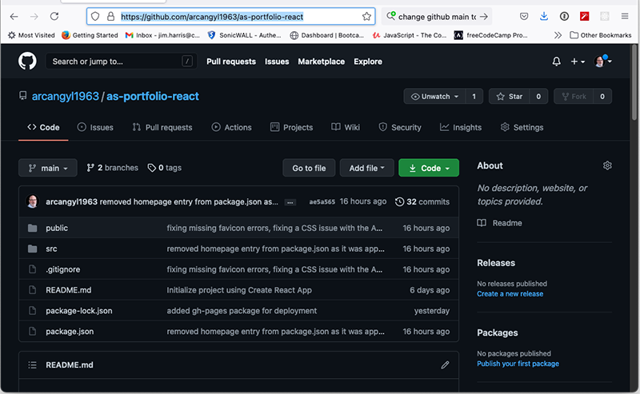
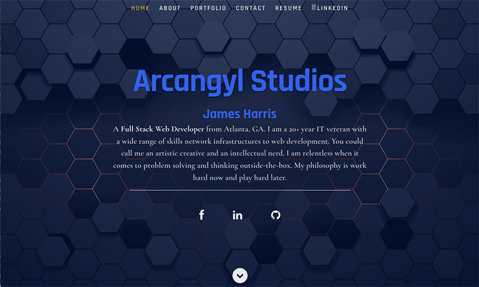
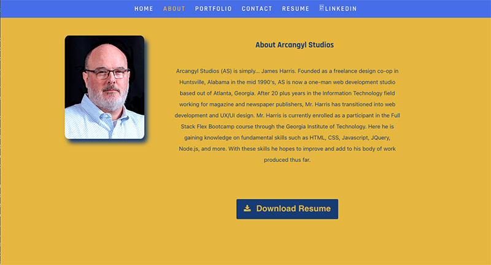
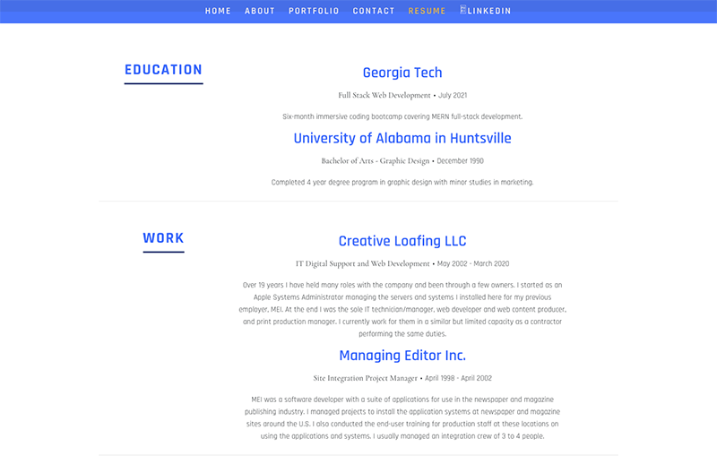
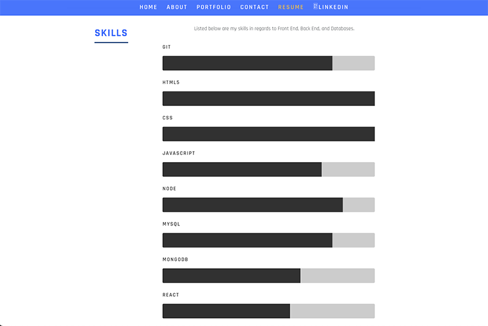
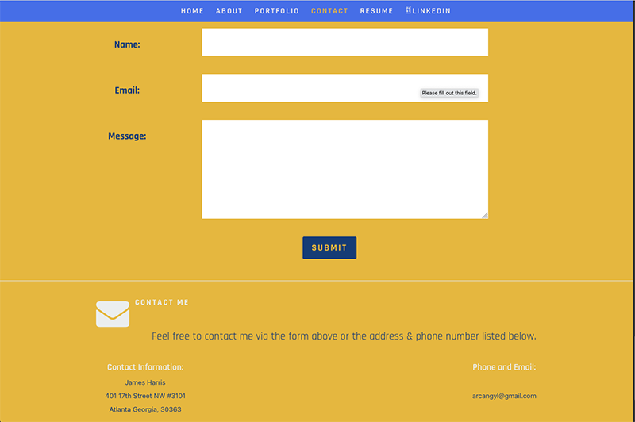
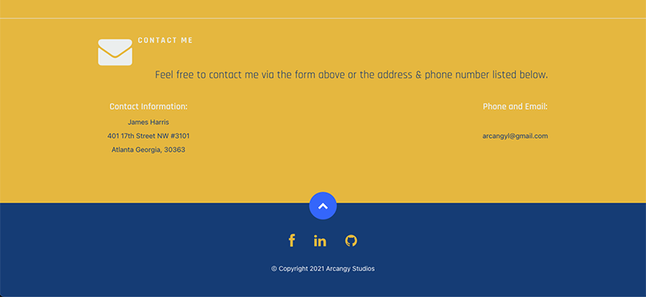

# AS REACT Portfolio 

## Description

Completely rebuilt portfolio as a REACT app. It now includes an updated gallery section for viewing work projects, a resume section with web development skill set and level of proficiency in the form of a bar graph. There is also a downloadable LinkedIn resume file as well as navigation links to the LinkedIn profile page.

Utilizes the following technologies:
  * HTML
  * JavaScript
  * JQuery
  * CSS
  * NodeJS
  * ReactJS
---

## Table of Contents 

[Usage](#usage) 

[License](#license) 

[Contributors](#contributors) 

[Tests](#tests) 

[Questions](#Questions) 

---

## Usage

My files can be accessed in the repository [HERE](https://github.com/arcangyl1963/as-portfolio-react) 

The image below shows the repository where my project files are located: 

 

The deployed web application can be viewed [HERE](https://as-portfolio-react.herokuapp.com/). 

The images below show the new React portfolio page design and highlights to some of the new features that have been added: 

The Home section shows the redesigned layout featuring the same theme and background image of the previous version of the portfolio. It includes a brief introductory statement and social network links. The page works the same as before with scrolling and navigation, but each section has been redesigned and a Resume section added. 

 

Clicking the About button in the navbar scrolls down to display the About section with profile image and bio information. Note the About nav button color changes when it is the active selection. Included here is a 'Download Resume' button to download a PDF version of the LinkedIn resume. 

 

Clicking the Resume button in the navbar scrolls down to display the newly added Resume section. This section is divided into three subsections - Education, Work, and Skills. The Skills section includes the various web development technoligies and the level of proficiency with each. 

 
 

Clicking the Contact button scrolls to display the Contact section. A contact form has been added in addition to the listing the contact information below the form. 

 

Below the Contact section is the Footer section. Here we again display the social network links and the copyright information. 

 

## License: 

 This software is licensed under an MIT license:  Copyright © 2021 Arcangyl Studios  Permission is hereby granted, free of charge, to any person obtaining a copy of this software and associated documentation files (the 'Software'), to deal in the Software without restriction, including without limitation the rights to use, copy, modify, merge, publish, distribute, sublicense, and/or sell copies of the Software, and to permit persons to whom the Software is furnished to do so, subject to the following conditions: The above copyright notice and this permission notice shall be included in all copies or substantial portions of the Software. THE SOFTWARE IS PROVIDED 'AS IS', WITHOUT WARRANTY OF ANY KIND, EXPRESS OR IMPLIED, INCLUDING BUT NOT LIMITED TO THE WARRANTIES OF MERCHANTABILITY, FITNESS FOR A PARTICULAR PURPOSE AND NONINFRINGEMENT. IN NO EVENT SHALL THE AUTHORS OR COPYRIGHT HOLDERS BE LIABLE FOR ANY CLAIM, DAMAGES OR OTHER LIABILITY, WHETHER IN AN ACTION OF CONTRACT, TORT OR OTHERWISE, ARISING FROM, OUT OF OR IN CONNECTION WITH THE SOFTWARE OR THE USE OR OTHER DEALINGS IN THE SOFTWARE. 

---

## Contributors: 

James Harris 

---

## Tests: 

There were no test scripts created for this application. 

---

## Questions: 

- Feel free to email me with any questions about this project at: arcangyl@gmail.com 

 

- My GitHub profile may be viewed by clicking [here](https://github.com/arcangyl1963).

© 2021 arcangyl studios